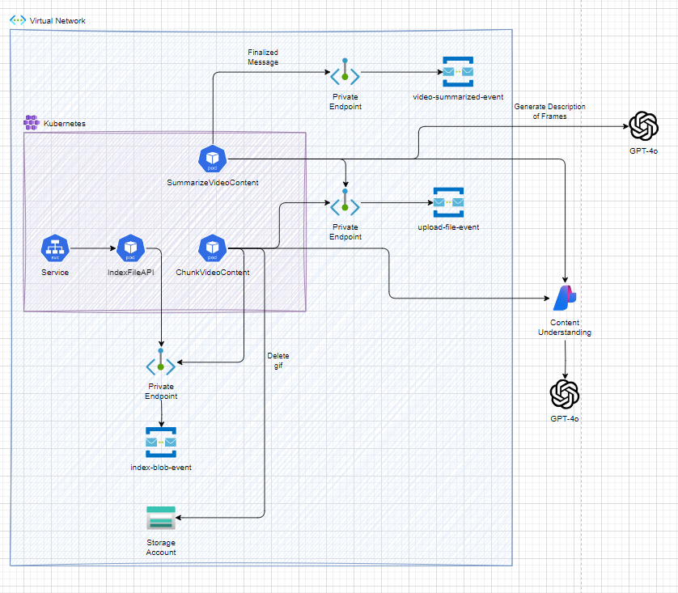

# Video RAG Pipeline

## Project Summary
The Video RAG Pipeline is a reactive video processing system built from three interdependent services:
1. **index_file_api**: Receives file payloads, validates inputs, and enqueues file metadata via Azure Service Bus.
2. **chunk_video_content**: Downloads and processes video files. If the file is a GIF then the process downloads the file, uploads it to Azure Blob Storage, and forwards content URLs for analysis. For MP4 files, the files are sent directly for analysis. We utilize either the url extension or the content-type for the file format.
3. **summarize_video_content**: Retrieves processed content, invokes the Azure OpenAI service in a two-stage approach (first summarization then consolidation), and produces a final summary.

## Project Architecture


### index_file_api
Index File API serves as the entry point for the Video RAG Pipeline. It exposes a RESTful API endpoint that accepts incoming file URLs, validates the content type, and constructs blob metadata for further processing. The service is built on asynchronous frameworks with dependency injection to ensure modularity and resilience, and it appends unique correlation and trace identifiers for robust tracking in downstream operations. After validating the payload, the metadata is enqueued to an Azure Service Bus queue to trigger subsequent processing by other microservices. Overall, this component ensures reliable ingestion and initial transformation of file data for the entire pipeline.

#### Sample Request
```json
    {
	    "id": "c0e575f5-35d7-40cf-9218-e0187e99998c",
	    "fileUrl":"http://contoso.com/sample.mp4"
    }
```

**Settings:**
- `service_bus_namespace`: Fully qualified Service Bus namespace.
- `index_file_queue`: Name of the queue used for index files.
- `logging_level`: Logging level (default: ERROR).
- `allowed_mime_types`: File extensions that are supported by this process (default: gif, mp4)

**Execution:**
- Development: `uv run index_file_api --env-file .env`
- Docker:  
  Build: `docker build -t index_file_api . --build-arg PROJECTPATH=index_file_api`

---

### chunk_video_content
**Description:**  
The chunk_video_content service efficiently handles video ingestion and processing by first determining if an input file is a GIF through its extension or content-type header. Upon detecting a GIF, it downloads the file and utilizes an animated GIF converter to generate an MP4 version. This converted video is then seamlessly uploaded to Azure Blob Storage, ensuring a standardized format for further analysis. Simultaneously, the service triggers the content understanding process by transmitting the file URL to an external API, and all these operations are managed asynchronously for high scalability and performance.

**Settings:**
- `service_bus_namespace`: Namespace for message operations.
- `index_file_queue`: Queue used for preliminary file indexing.
- `finalize_content_queue`: Queue utilized for final content processing.
- `content_understanding_endpoint`, `content_understanding_key`, `content_understanding_api_version`: Parameters for the content understanding service.
- `video_analyzer_name`: Video analyzer service identifier.
- `storage_account_name`: Storage account name for storing gifs.
- `storage_container_name`: Storage account container name to save gifs to.
- `storage_account_api_key`: Storage account key (optional if you are using a managed identity).
- `mp4_output_path`: Filesystem path for temporary MP4 files.
- `logging_level`: Diagnostic logging level.

**Execution:**
- Development: `uv run chunk_video_content --env-file .env`
- Docker:  
  Build: `docker build -t chunk_video_content . --build-arg PROJECTPATH=chunk_video_content`

---

### summarize_video_content
**Description:**  
The summarize_video_content service is designed to generate a comprehensive yet concise textual summary of video content. It retrieves processed content—including transcribed segments and analysis results—from earlier pipeline stages, and then applies a two-pass summarization mechanism using Azure OpenAI. In the first pass, it compiles segmented transcriptions into a single cohesive narrative; in the second pass, it refines the narrative to ensure clarity, smooth transitions, and preservation of contextual details from both visual and audio inputs. This approach not only enhances the readability of the final summary but also supports robust handling of variations in video content, all while leveraging asynchronous processing for high scalability and performance.

**Settings:**
- `service_bus_namespace`: Messaging configuration.
- `finalize_content_queue`
- `video_summary_queue`: Queues for finalizing and summarizing video content.
- `cognitive_services_endpoint`: Endpoint for Azure Cognitive Services.
- `azure_openai_endpoint`, `azure_openai_api_version`, `azure_openai_model_name`: Parameters for the Azure OpenAI service.
- `content_understanding_endpoint`, `content_understanding_key`, `content_understanding_api_version`: For additional content validation.
- `video_analyzer_name`, `storage_account_name`, `storage_container_name`: For accessing analyzed and stored video content.
- `logging_level`: Adjustable logging parameters.

**Execution:**
- Development: `uv run summarize_video_content --env-file .env`
- Docker:  
  Build: `docker build -t summarize_video_content . --build-arg PROJECTPATH=summarize_video_content`

---

## Resources Needed
- **Azure Service Bus:** For asynchronous messaging between services.
- **Azure Blob Storage:** To store uploaded video files.
- **Azure Cognitive Services:** For content analysis and understanding.
- **Azure OpenAI Service:** To generate and consolidate video summaries.
- **Azure Container Apps or AKS:** Hosts individual microservices in containerized environments.

## Additional Information
- Update the `.env` file with appropriate values for each setting.
- The pipeline leverages dependency injection and asynchronous frameworks for robustness.
- Logging and error handling are integrated to facilitate traceability and troubleshooting.
